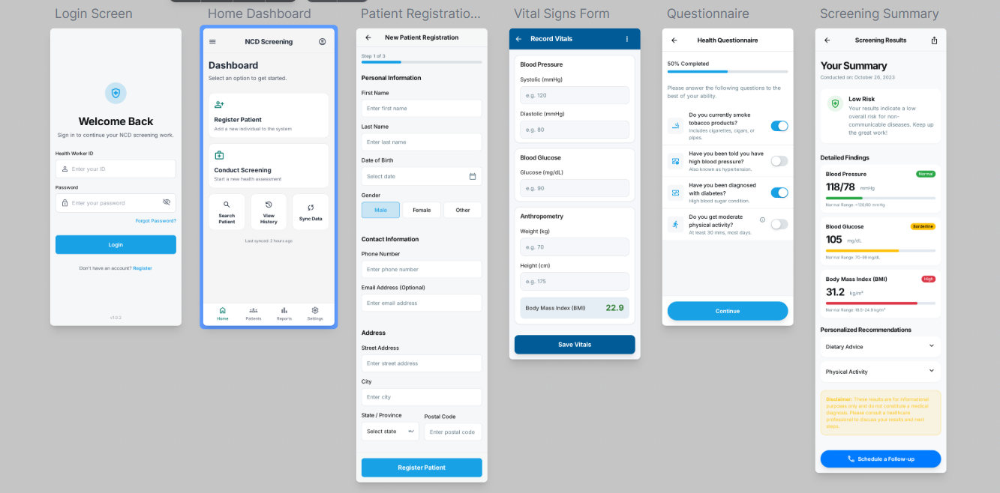

# NCD Screener – Non-Communicable Disease Screening App

## Project Proposal

**Project Name:** `final-project-group-af`  
**Course:** Mobile Programming  
**Group:** AF  
**Submission Date:** 9th November 2025

---

## Team Composition

| Name                             | Student ID | Primary Responsibility                  |
| -------------------------------- | ---------- | --------------------------------------- |
| Uwera Masereri Prisca            | 25570      | Patient Screening Data Management       |
| Hirwa Germain                    | 25571      | Questionnaire and Risk Factor Interface |
| Ikuzwe Nfuranzima O’neal Dauphin | 24714      | Observation Data Capture (BP, Glucose)  |
| Familoni Emmanuel Eniola         | 25951      | FHIR API Integration                    |
| Iradukunda Oscar                 | 26281      | Data Processing & Parsing               |
| Gahunde Simbi Gloria             | 25435      | Referral & Counseling Module            |
| Murenzi Munyaburanga Ivan        | 25868      | User Interface Design                   |
| Mbabazi Yvette                   | 25946      | Application Navigation                  |
| Ishimwe Alain Pacifique          | 26567      | Quality Assurance                       |

---

## 1. Project Concept

### Problem Statement

Non-communicable diseases (NCDs) such as hypertension and diabetes are leading causes of morbidity and mortality worldwide. In many communities, early detection is hindered by limited screening tools and poor follow-up systems. Community health workers often lack digital tools to efficiently collect and manage NCD screening data.

### Proposed Solution

The **NCD Screener** is an Android-based mobile application designed to assist community health workers in screening adults for common NCDs such as hypertension and diabetes. The app records vital signs, risk factors, and screening outcomes, and provides basic counseling or referral recommendations based on results.

---

## 2. FHIR Integration Strategy

### Core FHIR Resources Utilization

Our project leverages the **FHIR R4** standard to represent clinical and screening data.

**Primary Resources:**

- **`Patient`** – Basic demographic data of the screened individual
- **`Observation`** – Captured vital signs such as blood pressure, BMI, and glucose level
- **`QuestionnaireResponse`** – Answers from screening questionnaires (lifestyle, symptoms, etc.)
- **`Condition`** – Screening results indicating possible hypertension or diabetes
- **`ServiceRequest`** – Referrals for further testing or clinical follow-up

### Example FHIR Endpoints

```http
# Retrieve patient demographic info
GET /Patient/{patientId}

# Record a new blood pressure observation
POST /Observation

# Submit questionnaire response
POST /QuestionnaireResponse

# Record screening outcome (e.g., hypertension detected)
POST /Condition

# Create referral to health facility
POST /ServiceRequest
```

## FHIR Server Configuration

- **Development Server:** HAPI FHIR Public Test Server (`http://hapi.fhir.org/baseR4`)
- **FHIR Version:** R4
- **Authentication:** Open access for prototype development
- **Data Format:** JSON

---

## 3. Technical Approach

### Development Framework

- **Platform:** Android Native
- **Programming Language:** Java
- **IDE:** Android Studio
- **Architecture Pattern:** MVVM (Model-View-ViewModel)

### Key Technical Components

#### Data Layer

- Retrofit for RESTful FHIR API communication
- Gson for parsing FHIR JSON responses
- Repository pattern for modular data access

#### Presentation Layer

- RecyclerView for displaying patient lists and screening data
- Fragment-based UI navigation
- LiveData and ViewModel integration for reactive updates

#### Business Logic Layer

- Health data validation utilities
- Risk scoring algorithms (e.g., for blood pressure categories)
- Condition evaluation and referral logic

---

## 4. Feature Specifications

### Core Features

#### Patient Registration and Management

- Capture demographic data
- View and update screening history

#### NCD Screening Form

- Record blood pressure, glucose, weight, and risk factors
- Auto-calculate BMI and risk score

#### Counseling and Referral

- Provide personalized lifestyle advice
- Generate referrals using `ServiceRequest`

#### Data Synchronization

- Offline data capture with sync support
- Secure FHIR-compliant transmission to server

---

## 5. Implementation Plan

### Phase 1: Foundation

- Android project setup and repository configuration
- FHIR API testing using Retrofit
- Base UI setup and navigation

### Phase 2: Core Features

- Patient registration and screening workflow
- Observation and questionnaire integration
- Referral system and counseling screens

### Phase 3: Refinement

- UI/UX improvements
- Local database for offline caching
- Testing, debugging, and documentation

---

## 6. Expected Outcomes

### Technical Deliverables

- Functional Android screening application
- Integrated FHIR data exchange
- Entity relationship and architecture documentation
- Source code under version control

### User Benefits

- Simplified and standardized screening workflow
- Early detection of hypertension and diabetes
- Enhanced referral tracking and reporting
- Improved data quality and health outcomes

---

## 7. Innovation Value

This project illustrates the power of **FHIR standards** in enabling interoperable mobile health solutions for community-level disease screening. By digitizing and structuring NCD data, it promotes early detection, efficient follow-up, and better integration with national health systems.

---

## 8. Compliance & Standards

- **FHIR R4** compliance for structured health data
- **Android development** best practices
- **Data privacy** through secure, read-only FHIR transactions
- **Healthcare interoperability** via standardized resources

---

## 9. System Architecture & Diagrams

### 1. Class Diagram (FHIR Entities)


### 2. Data flow diagram


### 3. Usecase diagram


**Approval Requested:**  
This proposal outlines the group’s plan to develop a standardized, FHIR-compliant **Non-Communicable Disease (NCD) Screener** mobile application that empowers community health workers to identify, record, and manage NCD risks effectively using Android and interoperable health data standards.

## Prototype or wireframe sketch

<<<<<<< HEAD

=======

>>>>>>> origin/dev
